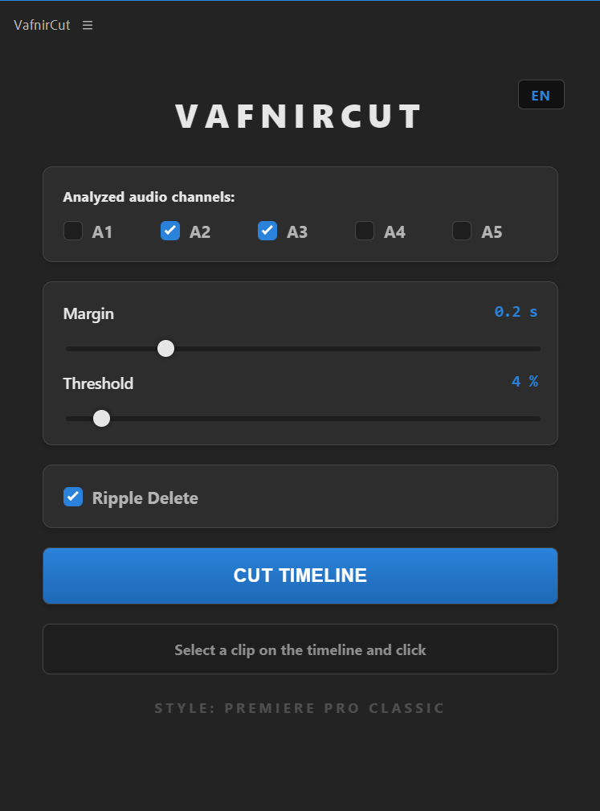

**English** | [Русский](README.ru.md)

# ✂️ VafnirCut — Automated Silence Cutter for Premiere Pro

  
  
  
  
<em>A powerful multi-channel auto-editor with 8 stunning themes and live timeline cutting.</em>

**VafnirCut** is a free and stylish extension for Adobe Premiere Pro that automatically cuts out silence and heavy breaths from your video and audio tracks using neural networks (powered by [auto-editor](https://github.com/WyattBlue/auto-editor)).

No more spending hours on rough cuts or dealing with messy XML imports — the **VafnirCut Sniper Bot** does it live directly on your timeline in one click!

## ✨ Key Features

* 🎙️ **Multi-channel analysis:** Select any audio tracks (A1-A5) to detect silence.
* 🎛️ **Fine-tuning:** Precise sliders for Margin, Noise Threshold, and a Ripple Delete toggle.
* ⚡ **Live "Sniper Bot" Cutting:** Watch the plugin magically place In/Out points and delete silence right on your active timeline in real-time.
* 🎨 **Custom Design:** 7 animated themes with custom canvas engines (Matrix, Cyberpunk, Ocean, Lava, Space, Winter, Gold) and 1 strict *Premiere Pro Classic* theme for minimalists.
* 💾 **Smart Memory:** The plugin remembers all your sliders, checkboxes, UI language, and selected theme even after a restart.
* 🤖 **Full Automation:** The `.exe` installer will automatically download Python, configure the neural network, and place the plugin in your system folders.

## 📥 How to Install (Windows)

1. Go to the **[Releases](https://github.com/MrVAFNIR/PremierePro-silence-cutter-VafnirCut/releases/latest)** section on the right side of this page and download `VafnirCut_Installer.exe`.
2. Run the file **as Administrator**.

> **⚠️ IMPORTANT:** Since the installer automatically configures Adobe system folders and silently installs Python, *Windows Defender or your antivirus may show a warning*. This is totally normal! Click **"More info" -> "Run anyway"**. The source code is open and available in this repository.

3. Wait for the black installation window to close.
4. **CRITICAL STEP FOR LIVE CUTTING:** Open Premiere Pro and go to `Edit` -> `Keyboard Shortcuts`.
   * Search for **Timeline** (`Window -> Timeline`) and assign it to the **F8** key.
   * Search for **Lift** and assign it to the **F7** key.
5. Restart Premiere Pro.

## 🚀 How to Use

1. Open Premiere Pro.
2. In the top menu, navigate to: `Window` -> `Extensions` -> `VafnirCut`.
3. **Select the clip** on the timeline that you want to process.
4. Adjust the threshold and select the tracks to analyze in the plugin.
5. Click **"CUT TIMELINE"**.
6. **Hands off the mouse!** The plugin's bot will take control and automatically cut your timeline in seconds.

## ☕ Support the Author

If this plugin saved you hours of tedious work and preserved your nerves, you can say thanks and support future updates! Any support is highly motivating:

💳 **[Support the project on DonationAlerts](https://www.donationalerts.com/r/vafnir)**

## 🛠️ Compatibility

* Adobe Premiere Pro CC 2020 and newer.
* Windows 10 / Windows 11.

---

*Made with soul for editors, by an editor.*
